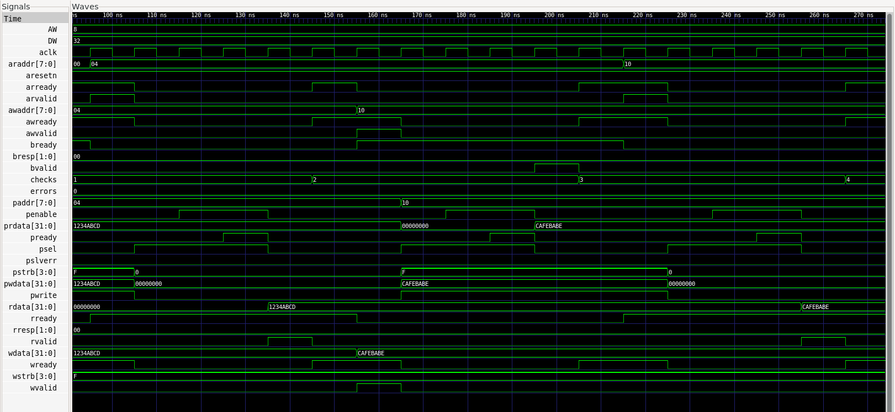

# AXI4-Lite to APB Bridge Verification

I built this project to improve my RTL design and verification skills. The design receives AXI4-Lite read and write requests and converts them into APB transfers for a simple memory slave.

## Test result

```text
AXI_APB_TEST_PASS checks=5 errors=0
```

The smoke test completed two writes, two reads and one invalid-address transaction. The testbench checked the returned data and the error response automatically.

## Waveform

This waveform was generated from the passing test and reviewed in GTKWave.



I used it to compare the AXI handshakes with the APB setup and access phases. It shows how each AXI request becomes an APB transfer and how the response returns to AXI.

## What is included

- AXI4-Lite to APB bridge RTL
- APB memory slave with wait-state and error support
- Self-checking functional smoke test
- UVM driver, monitor, scoreboard and coverage structure
- SystemVerilog protocol assertions
- Regression automation with repeatable seeds
- Intentional bug cases and root-cause-analysis notes

## Tools used

- SystemVerilog
- Icarus Verilog
- GTKWave
- Python and Make
- VS Code
- Git and GitHub

## Project folders

```text
rtl/              RTL design
tb/smoke/         Functional smoke test
tb/uvm/           UVM environment
tb/assertions/    Protocol assertions
scripts/          Simulation and regression scripts
docs/             Waveform, verification plan and RCA notes
```

## Assertions and coverage

The assertion module checks APB setup/access behavior, signal stability during wait states and AXI response stability during backpressure. UVM, assertions and coverage code are included, but I only report results that were actually measured. The confirmed result in this repository is the Icarus Verilog smoke test: **5 checks and 0 errors**.

## How I debug

When a test fails, I check the test name, seed and failure time. I open the waveform, compare AXI and APB signals, locate the first incorrect value and trace it back to the RTL or testbench. After the fix, I rerun the same test and then the regression.

## Final explanation

I designed and verified an AXI4-Lite to APB bridge. I tested write, read and invalid-address transactions using a self-checking testbench. I reviewed the waveform to verify the AXI handshakes, APB phases, data and responses. I also added UVM components, assertions, regression scripts and documented bug analysis.
